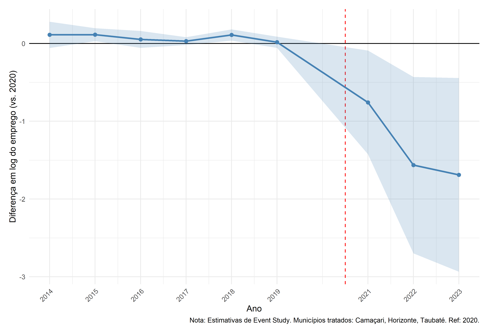
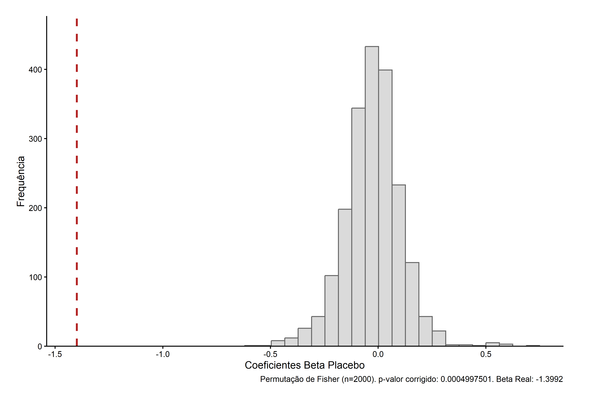

# Saída da Ford e Emprego Setorial no Brasil

**Estimativa DDD com Efeitos Fixos, Estudo de Evento e Testes de Robustez**

> **Autores:**
> Shauna Bobadilha Rodrigues de Lima (UFPel) ·
> Alisson Tallys Geraldo Fiorentin (UFRGS) ·
> Gibran da Silva Teixeira (FURG)

---

## Resumo

Este artigo estima o efeito causal do encerramento das operações industriais da Ford no Brasil, anunciado em 2021 e concentrado nas plantas de **Camaçari (BA)**, **Taubaté (SP)** e **Horizonte (CE)**, sobre o emprego formal no complexo automotivo. Utilizamos microdados da RAIS (2014–2023) agregados ao nível município × setor × ano, com estratégia de identificação por **Diferenças em Diferenças Tripla (DDD)** e efeitos fixos de alta dimensão.

<div align="center">

| Resultado principal | Valor |
|:---|:---|
| Coeficiente DDD ( $\hat{\beta}$ ) | −1,3992 |
| Erro-padrão (cluster municipal) | 0,477 |
| p-valor | 0,0034 |
| Efeito percentual $\left(e^{\hat{\beta}}-1\right)$ | **−75,3%** |
| p-valor placebo espacial (Fisher, B = 2.000) | ≈ 0,0005 |

</div>

---

## Objetivos

1. Estimar causalmente o impacto do fechamento das plantas sobre o emprego formal do complexo automotivo nos municípios expostos.
2. Isolar o efeito líquido da Ford separando tendências agregadas, choques setoriais nacionais e choques locais comuns.
3. Avaliar persistência temporal via estudo de evento e verificar tendências paralelas no pré-tratamento.
4. Testar transbordamento (*spillover*) espacial para municípios vizinhos via modelo SLX-DDD.
5. Validar a identificação com placebos temporal e espacial (permutação de Fisher).
6. Comparar seis estimadores com premissas distintas para demonstrar robustez do resultado.

---

## Metodologia

### 1. Dados

- **Fonte:** RAIS — vínculos formais ativos em 31/12, estados BA, SP e CE, 2014–2023
- **Unidade:** município $m$ × setor $s$ × ano $t$
- **Municípios tratados:** Camaçari/BA (IBGE 2905701), Taubaté/SP (IBGE 3554102), Horizonte/CE (IBGE 2305233)
- **Ano de tratamento:** $T_0 = 2021$ (Ford); Horizonte: 2022 (Troller)
- Painel completado com $\text{Emp}_{mst} = 0$ para células sem vínculos observados

**Evolução nos municípios tratados:**

<div align="center">

| Ano  | Vínculos totais | Variação |
|:----:|:--------------:|:-------:|
| 2019 | 18.182 | — |
| 2020 | 16.528 | −9,1% |
| 2021 | 10.392 | **−37,1%** |
| 2022 |  9.949 | −4,3% |
| 2023 | 10.090 | +1,4% |

</div>

### 2. Complexo Automotivo — CNAE 2.0

<div align="center">

| Código | Denominação |
|:------:|:-----------|
| 29.10-7 | Fabricação de automóveis, camionetas e utilitários |
| 29.20-4 | Fabricação de caminhões e ônibus |
| 29.30-1 | Fabricação de cabines, carrocerias e reboques |
| 29.41-7 a 29.49-2 | Fabricação de peças e acessórios para veículos |
| 29.50-6 | Recondicionamento e recuperação de motores |
| 45.11-1 a 45.43-9 | Comércio, manutenção e representação de veículos |

</div>

### 3. Variável Dependente

$$Y_{mst} = \ln(\text{Emp}_{mst} + 1)$$

O termo $+1$ evita perda amostral por células com emprego zero e mantém interpretação aproximada em termos percentuais.

A variação percentual implícita no coeficiente estimado é:

$$\%\Delta\text{Emp} = 100 \cdot \left(e^{\hat{\beta}} - 1\right)$$

### 4. Indicadores Binários

$$D_m = \mathbf{1}\{m \in \{\text{Camaçari, Taubaté, Horizonte}\}\}$$

$$S_s = \mathbf{1}\{s \in \text{complexo automotivo}\}$$

$$\text{Post}_t = \mathbf{1}\{t \geq T_0\}, \quad T_0 = 2021$$

O termo central da identificação DDD é a interação tripla:

$$\text{DDD}_{mst} = D_m \times S_s \times \text{Post}_t$$

### 5. Modelo Principal — DDD com Efeitos Fixos de Alta Dimensão

$$\boxed{Y_{mst} = \beta \cdot \text{DDD}_{mst} + \alpha_{m \times t} + \gamma_{s \times t} + \delta_{m \times s} + \varepsilon_{mst}}$$

<div align="center">

| Efeito fixo | Notação | O que absorve |
|:---:|:---:|:---|
| Município–ano | $\alpha_{m \times t}$ | Choques locais comuns a todos os setores em dado ano |
| Setor–ano | $\gamma_{s \times t}$ | Choques setoriais agregados nacionais por ano |
| Município–setor | $\delta_{m \times s}$ | Heterogeneidade estrutural persistente por par município-setor |

</div>

**Estimação:** MQO com absorção de efeitos fixos (`fixest::feols`).
**Inferência:** erros-padrão robustos agrupados no nível municipal.

> **Resultado:** $\hat{\beta} = -1{,}3992$ (EP $= 0{,}477$; $p = 0{,}0034$) $\Rightarrow$ **−75,3%** de emprego formal automotivo nos municípios tratados após 2021.

### 6. Estudo de Evento

Seja $G_{ms} = D_m \times S_s$. A especificação dinâmica interage $G_{ms}$ com dummies anuais, normalizando o ano-base $T_\text{ref} = T_0 - 1 = 2020$:

$$Y_{mst} = \sum_{l \neq T_{\text{ref}}} \mu_l \cdot \mathbf{1}[t = l] \cdot G_{ms} + \alpha_{m \times t} + \gamma_{s \times t} + \delta_{m \times s} + \varepsilon_{mst}, \quad \mu_{2020} = 0$$

Sob tendências paralelas condicionais e ausência de antecipação:

$$\hat{\mu}_l \approx 0 \quad \forall\; l < T_0$$

Desvios sistemáticos no pré-tratamento indicariam violação das hipóteses de identificação.

<p align="center">
  
  <br><em>Figura 1 — Estudo de evento: efeitos dinâmicos do choque DDD. Ano-base: 2020. Banda de 95% de confiança.</em>
</p>

### 7. Modelo Espacial — SLX-DDD

Para avaliar transbordamento (*spillover*) para municípios vizinhos (contiguidade Queen de primeira ordem):

$$Y_{mst} = \beta_1 \cdot \text{DDD}_{mst} + \beta_2 \cdot \text{DDD}^{\text{viz}}_{mst} + \alpha_{m \times t} + \gamma_{s \times t} + \delta_{m \times s} + \varepsilon_{mst}$$

onde

$$\text{DDD}^{\text{viz}}_{mst} = \text{Viz}_m \times S_s \times \text{Post}_t, \quad \text{Viz}_m = \mathbf{1}\{m \text{ é contíguo a um município tratado}\}$$

<div align="center">

| Coeficiente | Estimativa | EP | $p$-valor | Interpretação |
|:---:|:---:|:---:|:---:|:---|
| $\hat{\beta}_1$ | −1,4021 | 0,477 | 0,003** | Efeito direto nos municípios tratados |
| $\hat{\beta}_2$ | −0,2272 | 0,184 | 0,218 | Spillover para vizinhos (n.s.) |

</div>

Matriz de vizinhança: 16 municípios vizinhos (4 de Camaçari, 4 de Horizonte, 8 de Taubaté), malhas IBGE 2020 via `spdep`/`geobr`.

### 8. Placebo Temporal

Substitui-se $\text{Post}_t$ por um indicador placebo $\text{Post}_t^{(p)} = \mathbf{1}\{t \geq T_p\}$ com $T_p < T_0$:

$$\text{DDD}_{mst}^{(p)} = D_m \times S_s \times \text{Post}_t^{(p)}, \quad T_p \in \{2016, 2017, 2018, 2019\}$$

A amostra é truncada em $T_0 - 1$. Sob hipótese causal, $\hat{\beta}^{(p)}$ deve ser estatisticamente indistinguível de zero:

<div align="center">

| Ano placebo | $\hat{\beta}^{(p)}$ | Significativo? |
|:---:|:---:|:---:|
| 2016 | −0,0705 | Não |
| 2017 | −0,0128 | Não |
| 2018 | +0,0207 | Não |
| 2019 | −0,0623 | Não |

</div>

### 9. Placebo Espacial — Permutação de Fisher

Para cada réplica $b = 1, \ldots, B$ ($B = 2.000$), seleciona-se aleatoriamente um conjunto placebo $M^{(b)} \subset \mathcal{C}$ (pool de controles) com mesmo tamanho do grupo tratado:

$$X_{mst}^{(b)} = Z_m^{(b)} \times S_s \times \text{Post}_t, \quad Z_m^{(b)} = \mathbf{1}\{m \in M^{(b)}\}$$

O estimador por réplica via Frisch–Waugh–Lovell (FWL):

$$\hat{\beta}^{(b)} = \frac{\displaystyle\sum_{mst} \tilde{X}_{mst}^{(b)}\, \tilde{Y}_{mst}}{\displaystyle\sum_{mst} \left(\tilde{X}_{mst}^{(b)}\right)^2}$$

onde $\tilde{Y}$ e $\tilde{X}^{(b)}$ são as variáveis após remoção (*demeaning*) dos efeitos fixos $\alpha_{m \times t}$, $\gamma_{s \times t}$ e $\delta_{m \times s}$. O $p$-valor empírico unilateral (com correção de suavização finita):

$$p = \frac{1 + \displaystyle\sum_{b=1}^{B} \mathbf{1}\!\left[\hat{\beta}^{(b)} \leq \hat{\beta}_{\text{real}}\right]}{B + 1}$$

> **Resultado:** $p \approx 0{,}0005$ — o coeficiente real está na cauda extrema da distribuição placebo.

<p align="center">
  
  <br><em>Figura 2 — Placebo espacial: distribuição de β̂ das permutações de Fisher (B = 2.000). Linha vermelha: coeficiente real. p-valor ≈ 0,0005.</em>
</p>

### 10. Estimadores Alternativos (Robustez)

#### DD Simples

Subpainel apenas do setor automotivo. Sem "terceira diferença" intersetorial:

$$Y_{mt} = \tau \cdot (D_m \times \text{Post}_t) + \alpha_{m} + \gamma_{t} + \varepsilon_{mt}$$

#### Sun & Abraham (2021)

Ponderação por coorte via `fixest::sunab` para evitar contaminação em DID com heterogeneidade de efeitos:

$$Y_{mst} = \sum_{g}\sum_{l \neq -1} \delta_{g,l} \cdot \mathbf{1}[\text{coorte}_m = g] \cdot \mathbf{1}[t - g = l] + \alpha_{m \times t} + \varepsilon_{mst}$$

#### Callaway & Sant'Anna (2021)

Estimador duplamente robusto (*doubly robust*) via `did::att_gt`, com grupo de controle "never treated":

$$\text{ATT}(g, t) = \mathbb{E}\left[Y_t(g) - Y_t(0) \mid G = g\right]$$

agregado por `aggte(type = "simple")` e `type = "dynamic"`.

#### SDID — Diferenças-em-Diferenças Sintéticas

Via `synthdid`: combina ponderação sintética de unidades (como Controle Sintético) com ponderação temporal (como DD), sem impor estrutura paramétrica de efeitos fixos:

$$\hat{\tau}^{\text{SDID}} = \arg\min_{\tau,\,\alpha,\,\beta} \sum_{m,t} \left(Y_{mt} - \alpha_m - \beta_t - \tau \cdot D_{mt}\right)^2 \hat{\omega}_m \hat{\lambda}_t$$

### 11. Comparação dos Estimadores

<div align="center">

| Modelo | $\hat{\tau}$ | EP | $p$-valor | $\%\Delta\text{Emp}$ |
|:---|:---:|:---:|:---:|:---:|
| **DDD + EF** *(principal)* | **−1,3992** | 0,477 | 0,003** | **−75,3%** |
| DDD Espacial (direto) | −1,4021 | 0,477 | 0,003** | −75,4% |
| DD Simples | −1,3689 | 0,472 | 0,004** | −74,6% |
| Sun & Abraham | −1,3286 | 0,476 | 0,005** | −73,6% |
| Callaway & Sant'Anna | −1,3286 | 0,567 | 0,020* | −73,6% |
| SDID | −1,3476 | 0,706 | † | −74,0% |

</div>

† $t = -1{,}91$; EP *jackknife* conservador com $N_{\text{tratados}} = 3$. Significância não paramétrica confirmada pelo placebo de Fisher ($p \approx 0{,}0005$). \* $p < 0{,}05$; \*\* $p < 0{,}01$.

Os seis estimadores convergem em faixa de apenas 1,8 p.p. (−73,6% a −75,4%), abarcando métodos com premissas de identificação fundamentalmente distintas.

---

## Agenda de Pesquisa

1. **Heterogeneidade municipal:** desagregar o efeito para Camaçari, Taubaté e Horizonte individualmente, dado o porte distinto das plantas e o timing diferente da Troller (2022).
2. **Cadeia de fornecedores:** ampliar para setores adjacentes (metalurgia, plásticos, logística) para mensurar o multiplicador setorial do fechamento.
3. **Mecanismos de ajuste:** investigar realocação de trabalhadores para outros setores e municípios usando dados longitudinais da RAIS.
4. **Informalidade e renda:** usar PNAD Contínua e registros fiscais para capturar transbordamentos ao mercado informal.
5. **Impacto fiscal:** estimar efeitos sobre arrecadação municipal (ISS, IPTU) e dependência de transferências.

---

## Estrutura do Repositório

```
.
├── artigo/
│   ├── main.tex                    ← Artigo completo em LaTeX
│   ├── refs.bib                    ← Referências (37 entradas, natbib/apalike)
│   ├── main.pdf                    ← PDF compilado (20 páginas)
│   └── figuras/
│       ├── EventStudy_420dpi.png   ← Figura 1: Estudo de evento
│       └── PlaceboEspacial_420dpi.png ← Figura 2: Placebo espacial Fisher
│
├── scripts/
│   ├── R/
│   │   ├── DDD_FE_Geral.R          ← Modelo principal DDD+EF + event study + placebos
│   │   ├── DDD_Espacial.R          ← Modelo SLX-DDD (contiguidade Queen)
│   │   ├── DD_Simples.R            ← DD convencional (robustez)
│   │   ├── EventStudy_SunAbraham.R ← Estimador Sun & Abraham via fixest::sunab
│   │   ├── Callaway_SantAnna.R     ← Estimador Callaway & Sant'Anna via did::att_gt
│   │   ├── SDID.R                  ← SDID via synthdid
│   │   └── Estatisticas_Descritivas.R
│   ├── python/
│   │   ├── Base_RAIS.py            ← Processa microdados RAIS brutos → painel
│   │   └── Google_Cloud.py         ← Download alternativo via BigQuery (basedosdados)
│   └── stata/
│       └── Exportar_CSV_por_UF.do  ← Adiciona gvar e exporta painéis por UF
│
├── dados/           ← [não versionado] CSVs RAIS, PIB, população, CNAE (~41 MB)
├── outputs/         ← [não versionado] PNGs gerados pelos scripts R
├── referencias/     ← [não versionado] PDFs de artigos de referência (~204 MB)
│
├── .gitignore
└── README.md
```

---

## Pipeline de Reprodução

```bash
# 1. Processar microdados RAIS brutos (requer D:\RAIS Vínculos 2014-2023\)
#    Alternativa: python scripts/python/Google_Cloud.py  (download via BigQuery)
python scripts/python/Base_RAIS.py

# 2. Exportar painéis por UF com indicador gvar
stata-mp -b do scripts/stata/Exportar_CSV_por_UF.do

# 3. Estimação principal (DDD+EF, event study, placebos)
Rscript scripts/R/DDD_FE_Geral.R

# 4. Modelo espacial SLX-DDD
Rscript scripts/R/DDD_Espacial.R

# 5. Estimadores de robustez
Rscript scripts/R/DD_Simples.R
Rscript scripts/R/EventStudy_SunAbraham.R
Rscript scripts/R/Callaway_SantAnna.R
Rscript scripts/R/SDID.R
```

## Dependências

<div align="center">

| Linguagem | Pacotes |
|:---:|:---|
| R | `fixest`, `dplyr`, `tidyr`, `ggplot2`, `stringr`, `broom`, `writexl`, `sf`, `spdep`, `geobr`, `did`, `synthdid` |
| Python | `pandas`, `scikit-learn`, `numpy`, `basedosdados`, `openpyxl` |
| Stata | MP (para `import/export delimited`) |

</div>
